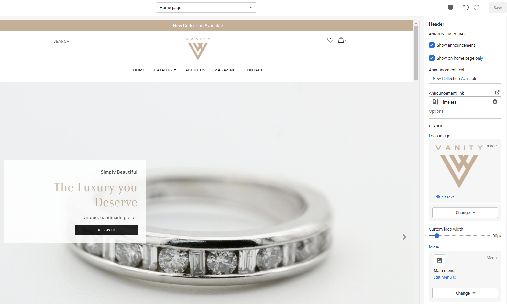

# Vanity Theme
> Documentation for Vanity, a Minimal, Multipurpose Shopify theme for Luxury products.

## About

_Vanity_ is an elegant, clean and minimal shopify theme best suited for luxury products. It is ideal for creating stores that sell jewelry, glasses, watches, perfumes, gifts, clothing or any other item that needs a clean and elegant look. It is packed with high-demand features like Ajax Cart, Dynamic Filters in the collection pages, Product image slideshow that focuses on the variation image on change, elegant call to action boxes, Ajax product pages, Ajax Wishlist and other.

It comes packed with high-demand features like: 

* Ajax Cart 
* Dynamic collection product filters
* Supports dedicated slideshow image per product variation
* Ajax Wishlist
* Customizable responsive image slider
* Collection product slider
* Blog posts summary
* Call to Action blocks
* Customizable Featured Product
* Customizable Image with text
* Customizable Footer

*Reliable Support* 
Start building your professional online presence without touching a line of code. We are always here to help you. 
This theme is backed with extensive documentation and regular updates.

Enjoy excellent after-sale support and theme updates as they become available.

See it action! Our demo is available here:

[Vanity Theme Live Demo](https://vanitytheme.myshopify.com)

## Start Customizing Vanity

Since you are using Shopify platform, most of the customization basics has been covered in the Shopify Official Documents here 
[Shopify Customizing Theme Official Documentation.](https://help.shopify.com/en/manual/online-store/themes/os/customize)

As a result, this User Guide will only contain Vanity’s theme customizations and settings.

## Theme settings
> Online Store > Customize (Theme Editor) > Theme settings
 
Vanity Theme is highly customizable. The following configurations are available in the Theme settings that will let you customize the the main elements of the theme.

#### Colors

There are three main options available in order to customize Vanity to your own brand colors:

__Accent__
Accent is the main colour used throughout the theme. Accent color will be used in the headers, buttons and other elements of Vanity.

__Text__
Text color will change the color of all the texts in the theme.

__Background__
Background color will change the color of the background of the theme.

#### Typography

Two main options are available:

__Headings__
Heading will change the fonts of the headings, buttons and other elements of the theme.

__Body text__
Body text font family will change the font of all the texts in the theme.

#### Social Media
These options let you configure your social media channels.

##### Social sharing image

If an image is uploaded in this setting, it will be shown when sharing a link on social media.

##### Social sharing options

__Enable sharing for blog articles__
If this option is enabled, social media  icons will become avaiable in the articles. They can be used to share the blog post page in social media.

__Share on Facebook__
Enables the share on Facebook icon.

__Tweet on Twitter__
Enables the share on Twitter icon.

__Pin on Pinterest__
Enables the share on Pinterest icon.

__Color__
The social media icon color.

##### Sharing links

The social media sharing links of your shop. Links of social media channels of the shop can be included here. 

#### Cart
__Enable cart notes__
This option enables a textarea in the cart page where the clients can leave notes for their order.

## Header

> How to find these settings.. Online Store > Customize (Theme Editor) > Sections > Header

### Announcement Bar
 - - -
 
A highlighted message can be displayed at the very top of the page. The following options are available:

#### Show Announcement 
  This checkbox will turn the Announcement Bar on or off.
  
#### Show on Homepage Only
  If this checkbox is on the Announcement Bar will show in the frontpage only

#### Announcement Text 
  The text in this textarea will show up in the Announcement Bar

#### Announcement Link 
  The Announcement Bar text will link to the selected item

## Footer

_TODO:Write footer documentation._

## Theme Settings

_TODO:Write footer documentation._

The theme supports unlimited dynamic filters that can be created from the Shopify backend. 
