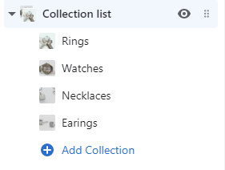

# Vanity Theme
## Documentation for Vanity, an elegant, clean and minimal Shopify theme for Luxury products.

## About

_Vanity_ is an elegant, clean and minimal shopify theme best suited for luxury products based on Bootstrap 4. It is ideal for creating stores that sell jewelry, glasses, watches, perfumes, gifts, clothing or any other item that needs a clean and elegant look. It is packed with high-demand features like Ajax Cart, Dynamic Filters in the collection pages, Product image slideshow that focuses on the variation image on change, elegant call to action boxes, Ajax product pages, Ajax Wishlist and other.

It comes packed with high-demand features like: 

* Ajax Cart 
* Dynamic collection product filters
* Supports dedicated slideshow image per product variation
* Ajax Wishlist
* Multiple Currency Support
* Customizable responsive image slider
* Collection product slider
* Blog posts summary
* Call to Action blocks
* Customizable Featured Product
* Customizable Image with text
* Customizable Footer

__Reliable Support__   
Start building your professional online presence without touching a line of code. We are always here to help you. 
This theme is backed with extensive documentation and regular updates.

Enjoy excellent after-sale support and theme updates as they become available.

See it action! Our demo is available here:

[Vanity Theme Live Demo](https://vanitytheme.myshopify.com)

## Start Customizing Vanity

Since you are using Shopify platform, most of the customization basics has been covered in the Shopify Official Documents here 
[Shopify Customizing Theme Official Documentation.](https://help.shopify.com/en/manual/online-store/themes/os/customize)

As a result, this User Guide will only contain Vanity’s theme customizations and settings.

# Theme settings
> Online Store > Customize (Theme Editor) > Theme settings
 
Vanity Theme is highly customizable. The following configurations are available in the Theme settings that will let you customize the the main elements of the theme.

## Colors

There are three main options available in order to customize Vanity to your own brand colors:

__Accent__
Accent is the main colour used throughout the theme. Accent color will be used in the headers, buttons and other elements of Vanity.

__Text__
Text color will change the color of all the texts in the theme.

__Background__
Background color will change the color of the background of the theme.

## Typography

Two main options are available:

__Headings__  
Heading will change the fonts of the headings, buttons and other elements of the theme.

__Body text__  
Body text font family will change the font of all the texts in the theme.

## Social Media

These options let you configure your social media channels.

### Social sharing image

If an image is uploaded in this setting, it will be shown when sharing a link on social media.

### Social sharing options

__Enable sharing for blog articles__  
If this option is enabled, social media  icons will become avaiable in the articles. They can be used to share the blog post page in social media.

__Share on Facebook__  
Enables the share on Facebook icon.

__Tweet on Twitter__  
Enables the share on Twitter icon.

__Pin on Pinterest__  
Enables the share on Pinterest icon.

__Color__  
The social media icon color.

### Sharing links
The social media sharing links of your shop. Links of social media channels of the shop can be included here. 

## Cart

__Enable cart notes__  
This option enables a textarea in the cart page where the clients can leave notes for their order.

## Money options

### Enable Multiple Currency Select list
If this checkbox is on, a select list of the enabled currencies will be displayed in the footer. Users can use this to change the currency of the shop. Multiple currencies need to be enabled for this to work. More information about how to setup multiple currencies can be found in [Shopify's documentation](https://help.shopify.com/en/manual/payments/shopify-payments/multi-currency/setup).

 - - -

# Header

> Online Store > Customize (Theme Editor) > Header

## Announcement Bar
 
A highlighted message can be displayed at the very top of the page. The following options are available:

### Show Announcement 
  This checkbox will turn the Announcement Bar on or off.
  
### Show on Homepage Only
  If this checkbox is on the Announcement Bar will show in the frontpage only.

### Announcement Text 
  The text in this textarea will show up in the Announcement Bar.

### Announcement Link 
  The Announcement Bar text will link to the selected item.

## Logo image  
  The logo of the store can be uploaded here.
  
## Logo width  
  This option will change the width of the logo.
  
## Main Menu  
  The main menu that shows in the header can be selected from this option.
  
   - - -
   
# Theme Sections

> Online Store > Customize (Theme Editor) > Footer

Vanity is rich with section blocks that you can easily drag and drop into the page, to create a unique layout.

The following sections are available:

## Blog Posts

This section will show a number of blog posts. Each blog post will show its title, image and sumamry.

It can be customized with the following settings:

### Heading
The header title of the section area. 

### Blog
Articles of the selected blog will show in this section. 

### Posts
The number of articles that should show. They are presented 3 in a row.

### Show Author
If this checkbox is on the name of the author will be displayed in the article summary.

### Show Date
If this checkbox is on the post date of the article will be displayed in the article summary.

---
## Collection list

This section will show the shop's collections. Each collection will be shown with its image and title. Configuration options allow the selection of the Collections that will be shown.

More collections can be included in the section by the Add Collection option that becomes available, when clicking on the Collection list label.

For each block, the collection can be selected from the block options. The button Select Collection will display all the available collections that can be chosen for the block.

## Collection slider

This slideshow will show products of the selected collection. It can be customized with the following settings:

### Title
The header title of the section area.

### Collection
Products from the chosen collection will show in the slideshow.

### Products per slide
The number of products to show on each slide.

### Show Product Vendors
If this checkbox is on, the vendor of the product will show up as well.

## Call to Action blocks

This section will show up to three call to action blocks. Each block supports a title, a text and a call to action button. 

### Heading
The title of the CTA (Call to Action) Block

### Text
The HTML text that shows up in the block.

### Button text
The text shown in the button.

### Button link
The destination after the user clicks on the button

## Image with text

This section will show an image and text. Image can show either on the left or the right side, depending on the configuration. 
It can be customized with the following settings:

### Image
The image that will show in the section.

### Image alignment
This will change the position of the image in the section. Options are Right and Left. 

### Heading
The title of the CTA (Call to Action) Block

### Text
The HTML text that shows up in the block.

### Button text
The text shown in the button.

### Button link
The destination after the user clicks on the button

## Slideshow

This is the main slideshow of the website. It will show in the frontpage only and it supports a block of text that will show on top of the slideshow image. This block is rich in configuration options; It can show on the left, center or right of the slideshow, with or without a semi-transparent background. It supports intro text, header, text and a button with customizable label and it allows a change in the text alignment (left, center right) in the block. 
The different configuration options of the text block make sure that it will show correctly on top of any image - dark or bright.  

This section supports configurations for the whole slideshow and also per slide. The available configuration options of the slideshow are:

### Enable autoplay
If this option is on, the slides will start flipping automatically on page load.

### Enable dots
If this option is on, one dot per slide will show at the bottom of the slideshow. Each dot is clickable and acts as navigation; on click it will change the slide.

### Enable arrows
If this option is on, clickable navigation arrows will show at the right and left of each slide.

### Change slides every
If autoplay option is on, this setting will change the number of seconds between each slide change.

When a Slide in the item tree is clicked, a new set of options will show. This set of options is availabe for each slide, and it allows unique configurations per slide. 

Available options are:

### Add image to the slideshow
The selected image will show in the slide.

### Intro Text
This text will show in smaller fonts right above the block title

### Slider Title
This text will show in bigger fonts as the block title.

### Slider Text
The text will show in smaller fonts right after the title.

### Button title
The label of the button.

### Slide link
The destination after the user clicks on the button

### Show background
If this option is on, a white semi-transparent background will show on the text block.

### Text block position
This option will change the block position on the slideshow. Avaialble options are left, center and right.

### Text alignment
This option will change the text alignment of the block. Avaialble options are left, center and right.

## Featured Product

This section will show a selected product. Avaialble options are:

### Heading
The title of the product

### Product
The selected product will show

### Pull product description from product page
If this option is on, the description from the product page will show.

### Product description
If the above option is off, the text from this option will show.

### Enable autoplay
If this option is on, the product slideshow will start automatically.

### Enable dots
If this option is on, one dot per slide will show at the bottom of the slideshow. Each dot is clickable and acts as navigation; on click it will change the slide.

### Enable arrows
If this option is on, clickable navigation arrows will show at the right and left of each slide.

### Image alignment
This will change the position of the slideshow in the section. Options are Right and Left. 

### Change slides every
If autoplay option is on, this setting will change the number of seconds between each slide change.

## Newsletter

This section will show a configurable form for signing up to the Newsletter.

Available options are

### Heading
The title of the Newsletter section

### Subheading
A smaller text that will show after the title and above the form.

## Announcement Banner

This section will show a full width block with a background. It will show some text with an action button on the right. Available options are:

### Link text
The label of the button

### Link
The destination after the user clicks on the button

### Text
The text that will show in the block.

## Rich Text

This section will show a block of text with a title. Available options are:

### Heading
The title of the block

### Text
The HTMLK text that will show after the heading.

   - - -
   
# Footer  

> Online Store > Customize (Theme Editor) > Footer
 

Footer supports up to 4 blocks. The order of the blocks can be easily configured by dragging and dropping the sections up and down in the list.
Vanity theme offers the following 3 sections:  

## Newsletter
This section can show a block with customizable title and text, the Newsletter form, and social media icons.

Available options are:

### Heading
The title of the block

### Text
An option text message that will show above the Newsletter form

### Show social media icons
If this checkbox is on, the social media icons will show below the Newsletter form.

## Text Section
This section can show a block with customizable title, an image, a textarea and the social media icons.

Available options are:  

### Image
The selected image will show in the block area

### Heading
The title of the block

### Text
Text that will show after the image.

### Show social media icons
If this checkbox is on, the social media icons will show below the text.

_Hint_: If the Text section is left empty, without any content, it can act as a separator between other footer sections. An empty text section will take up the space of a block, but nothing will show. 

## Footer Menu

This section will show a menu in the footer area. Configuration options are:

### Heading
The title of the block

### Menu
The selected menu will show in the footer

### Show social media icons
If this checkbox is on, the social media icons will show below the menu.

 - - -

# How to create Dynamic filters in the collection pages

Vanity can show dynamic filters in the collection pages. These option will filter products that match the selected filter options. New filters can be created by editing any product and inserting a new tag with the following format: Filter Name, __TWO__ underscore characters, the Filter Option.

> Filter Name\_\_Filter Option
 
 For example, the following tags will create a filter with the label Color and the options Small, Medium, Large
 
* Color__Small
* Color__Medium
* Color__Large
 
There is no limit to the amount of filters that can be created. If a collection page shows products that have tags with this format, the filters will be created and displayed in the sidebar automatically.
